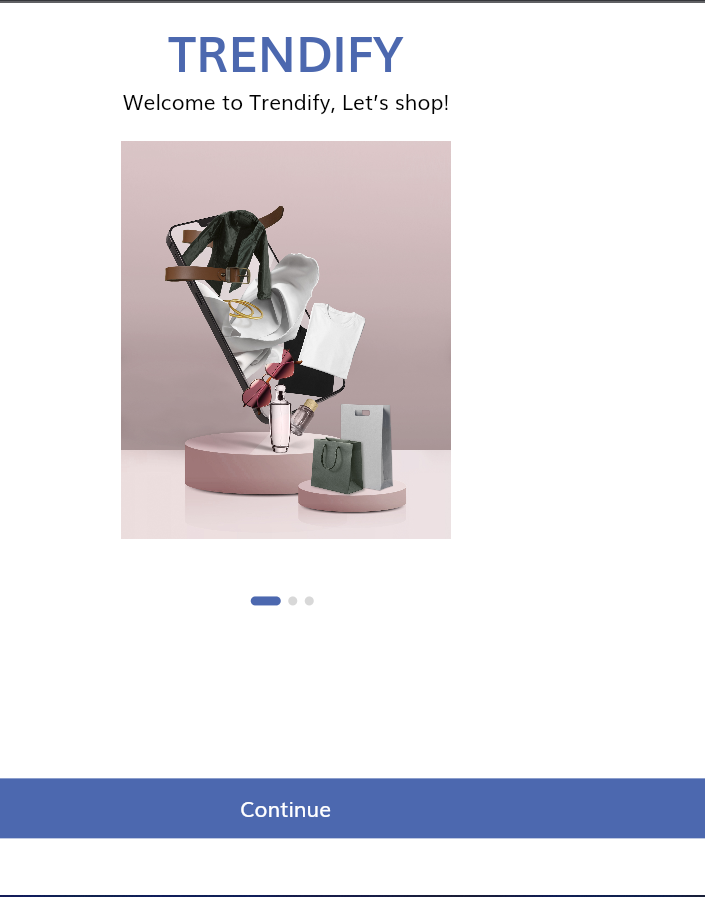
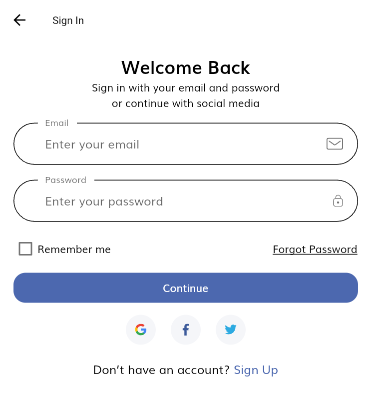
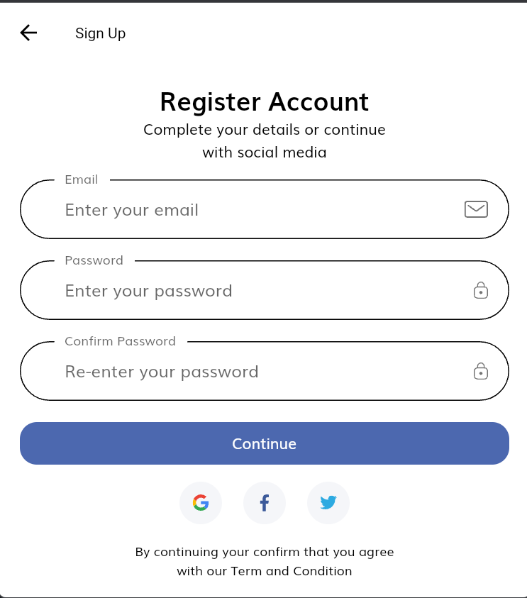
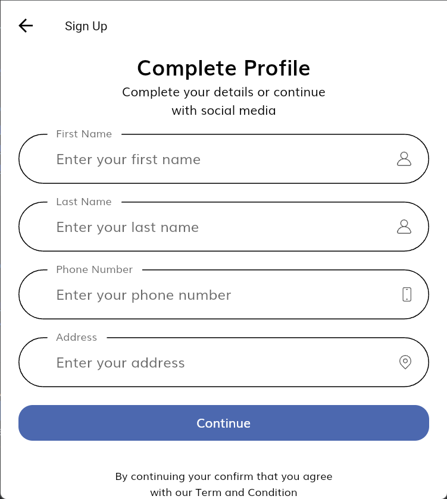
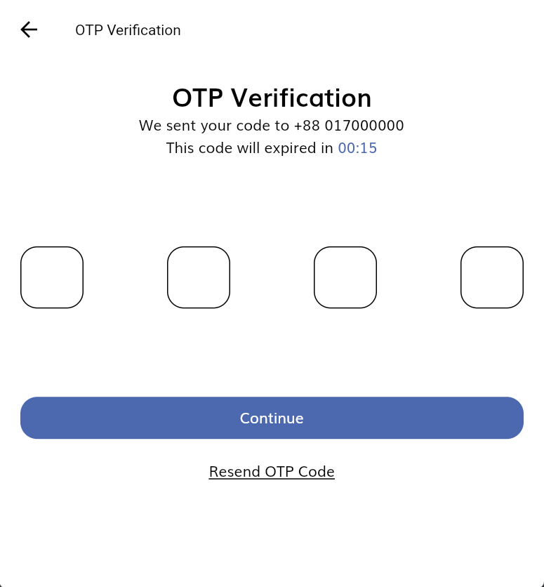
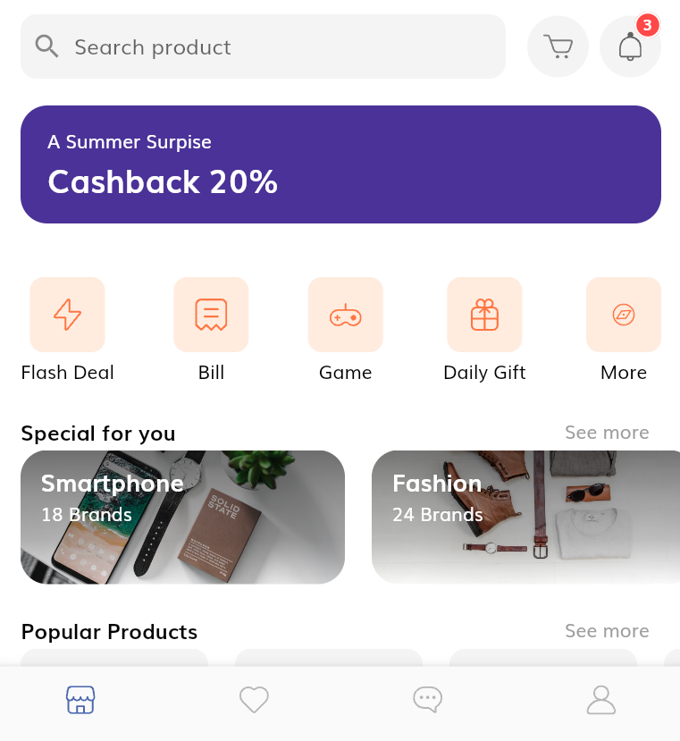

# trendify- Shopping App UI/UX Design

## Onboarding Screens
- Developed visually appealing onboarding screens for a seamless introduction to the app's features.
- Ensured a consistent and intuitive design across both Android and Windows platforms.

## Sign In and Forgot Password Screens
- Enhanced Sign In and Forgot Password screens with unique error messages for a personalized experience.
- Implemented design elements for smooth login and password recovery processes.

## Sign Up and OTP Processes
- Crafted a visually striking Sign Up screen and optimized OTP verification for seamless user registration.
- Implemented intuitive design choices for effective user guidance during the registration journey.

## Main Homepage
- Designed the main homepage with a focus on user engagement and easy navigation.
- Incorporated aesthetically pleasing elements and interactive features for an enjoyable user experience.

## Product Page
- Developed a clean and organized layout for effective product showcasing.
- Maintained a balance between aesthetics and functionality, optimizing the user experience for product exploration.

## Order Page with Swipe to Delete
- Introduced innovative features like 'swipe to delete' for enhanced user control.
- Implemented a user-centric design approach for an intuitive order management experience.

## User Profile Page
- Designed a visually appealing and informative user profile page.
- Focused on delivering a personalized touch to enhance user connection with the app.

## Screenshots

